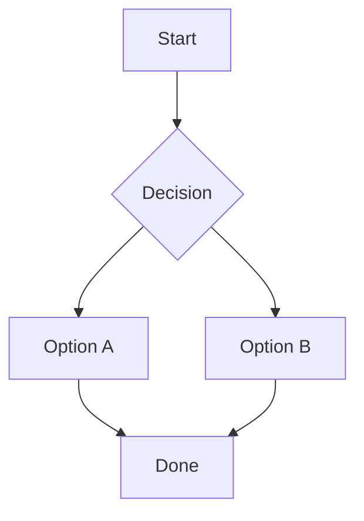
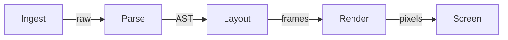
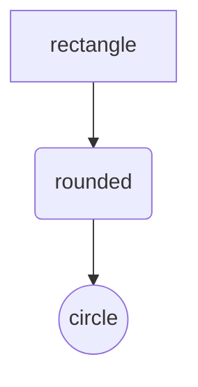

# Mermaid

## A simple flowchart



## Left-to-right with labels



## Shapes



## Unknown graph falls back to code

A plain code block should still render if the content is not a graph we can parse:

```mermaid
oops not a graph
```
