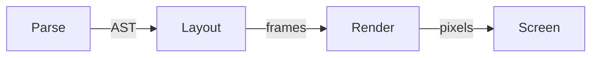

# mdrdr

A *from-scratch* markdown viewer in Rust. The whole parser, layout, text
shaping, math engine, and mermaid renderer live in this repo. The only
primitives we take are **winit** (window), **softbuffer** (pixels),
**fontdue** (glyphs), **image** (PNG/JPEG).

## Inline styling

The usual: **bold**, *italic*, combined ***bold italic***, `code spans`
hugging commas, and [links](https://example.com) with a little underline.

## Lists

- picks up the sibling files in the tree
- scrolls when the document is taller than the viewport
- live-reloads within ~250 ms when the file changes on disk

## Math

Inline: $e^{i\pi} + 1 = 0$ and $\sum_{k=1}^{n} k = \frac{n(n+1)}{2}$.

Display:

$$ \int_{-\infty}^{\infty} e^{-x^2} dx = \sqrt{\pi} $$

## Mermaid



## Images


## Block quote

> The only rule: everything above the primitive layer is written here.
> Parser, layout, HTTP server, math engine, mermaid — all ours.

---

## Code

```rust
fn main() {
    let mut fb = Framebuffer::new(1200, 900, theme.bg);
    draw(&layout(parse(source)), &mut fb);
    fb.save_png("preview.png").unwrap();
}
```

Last heading, just to prove word-wrap still hyphenates nothing and breaks
strictly at whitespace boundaries no matter how aggressively you resize.
